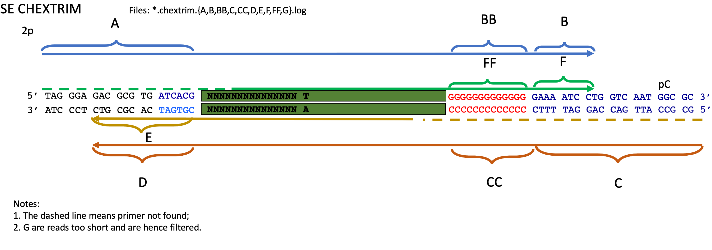

## 1. The PennSCAP-T NGS pipeline
The [PennSCAP-T NGS pipeline](https://github.com/kimpenn/ngs-pipeline) takes in the Illumina sequencer's flowcell image data, converts them into FASTQ files, performs quality check, trims low-quality bases and potential contaminants (e.g. primers/adapters), aligns reads to the source genome, and finally does read count quantification using hierarchical assignment of uniquely mapped reads to different genomic features [1]. 

The basic data structure consists of the folders:

```
E.XXX
    |--src
        |--[FLOWCELL_ID]
    |--raw
        |--Reports
        |--Sample_XXX
            |--XXX_1_S1_L001_R1_001.fastq.gz
            |--XXX_1_S1_L001_R2_001.fastq.gz
            |--XXX_1_S1_L002_R1_001.fastq.gz
            |--XXX_1_S1_L002_R2_001.fastq.gz
        |   --...
        |--Sample_YYY
            |--XXX_1_S1_L001_R1_001.fastq.gz
            |--...
        |--...
        |--Stats
    |--info
        |--config.csv
        |--SampleSheet.csv
        |--...
    |--analyzed
        |--Sample_XXX
            |--blast
            |--fastqc
            |--trim
            |--fastqc.trim
            |--star
            |--verse
            |--log
```

To preprocess CHEX-seq data specifically, the PennSCAP-T pipeline adds two extra steps.

### 1.1 RMDUP

This step examines a FASTQ (or two paired FASTQ files if paired-end sequencing), then searches for duplicate reads (or read pairs if paired-end sequencing), finally collapses the recuring reads into one so that all read strings are unique. The rationale is based on the biochemical nature of probe annealing—it's very unlikely the probe binds to the identical location in a single cell. 

RMDUP outputs two FASTQ files per input FASTQ file:
* unaligned_1.dupl.fq (containing the duplicates)
* unaligned_1.fq (containing the de-duplicated reads)

As part of the [PennSCAP-T NGS pipeline](https://github.com/kimpenn/ngs-pipeline), RMDUP is developed by Dr. Stephen Fisher and the source code is available at https://github.com/kimpenn/ngs-pipeline/blob/master/ngs_RMDUP.sh.

The additional folders corresponding to RMDUP are:

```
E.XXX
    |--analyzed
        |--Sample_XXX
            |--rmdup
            |--fastqc.rmdup
```

The folder `fastqc.rmdup` holds the FASTQC results for the RMDUP-ed data. 

### 1.2 CHEXTRIM

This step takes in the RMDUP-ed FASTQ file(s), the primer CONFIG file (e.g. data/ChexPrimerTable.conf) and annotates the read IDs (in R1 if paired-end sequencing) with information about if, where and in which strand the two primers (5' and 3' end) are found. The found primers (in part or full length) will be trimmed off, and after trimming, reads that are too short are discarded (but saved in a separate file).   

The primer CONFIG file has the structure as below:

```
505     20	TAGGGAGACGCGTGATCACG
505b    18	TAGGGAGACGCGTGATCA
507     20	TAGGGAGACGCGTGAGTTCC
...
```

The first column registers the primer identifier; the second column registers the length; the third column registers the sequence (the uppercase means the barcode base while lowercase means the spacer). 

For paired-end sequencing, the annotated read name (in R1 only) takes a look like:

```
@NB501328:212:HFW2MBGX9:2:22305:8919:10250-1:N:0:ACTGAT::D:0-R1_2p_fw~21,R1_pC_fw~0,R1_2p_rc~0,R1_pC_rc~51,R2_2p_fw~0,R2_pC_fw~23,R2_2p_rc~0,R2_pC_rc~0 L:53
```

Basically, every read pair has the 5' end (`2p`) and 3' end (`pC`) primer searched in both forward (`fw`) and reverse (`rc`) strand direction in both mates, hence producing an eight-element tag appended to the existing read name:

* R1_2p_fw
* R1_pC_fw
* R1_2p_rc
* R1_pC_rc
* R2_2p_fw
* R2_pC_fw
* R2_2p_rc
* R2_pC_rc

 

Figure 1. The definition of the `2p` and `pC` barcode/primer

Here, we define the barcode sequence as `2p` and the polyC sequence as `pC`, as shown in Figure 1. The numbers following the tilde indicates whether the primer is found (0 if not) and if found, how many bases are found. 

```
R1_2p_fw~21,R1_pC_fw~0,R1_2p_rc~0,R1_pC_rc~51,R2_2p_fw~0,R2_pC_fw~23,R2_2p_rc~0,R2_pC_rc~0
```
In the above example, we can see that the `2p` primer has 21 bases (from the 3' end) found and trimmed from R1, and the `pC` primer has 23 bases (from the 3' end) found and trimmed from R2. Besides, the reverse strand of `pC` is also detected at the R1's 3 end, hence the bases all the way down where it was found is also trimmed; the total trimmed length is 51. 

Schematically, below shows the location of the primers in this read pair. 

```
R1 
        2p forward                 pC reverse
X                     X    X                                                   X
[---------------------]----[---------------------------------------------------]>


R2                                                      X      pC forward      X
<-------------------------------------------------------[----------------------]

```

For single-end sequencing, we only search in R1 and the first four elements are output:

* R1_2p_fw
* R1_pC_fw
* R1_2p_rc
* R1_pC_rc

Besides the read name annotation, CHEXTRIM also produces LOG files that tracks the detailed results for each string search. They contain

* for paired-end data: {A,AA,AAX,AAA,AAAX,AAAA; B,BB,BBX,BBB,BBBX,BBBB; C,CX,CC,CCX,CCC; D,DX,DD,DDX; E,EE,EEX; F,FF,FFX; G,GX; H,HX; I}.log
* for single-end data: {A,B,BB,C,CC,D,E,F,FF,G}.log

Each file corresponds to one step of CHEXTRIM iterative search procedure and the definition of which can be depicted as the schematic below:

a)
 

Figure 2-1. CHEXTRIM procedure and output filename definition for paired-end sequencing

b)
 

Figure 2-2. CHEXTRIM procedure and output filename definition for single-end sequencing

As part of the [PennSCAP-T NGS pipeline](https://github.com/kimpenn/ngs-pipeline), CHEXTRIM is developed by Dr. Erik Nordgren. It is based on the software package `cutadapt` [2] and the source code is available at https://github.com/kimpenn/ngs-pipeline/blob/master/ngs_CHEXTRIM.sh.

The additional folders corresponding to CHEXTRIM are:

```
E.XXX
    |--analyzed
        |--Sample_XXX
            |--chextrim
            |--fastqc.chextrim
```
The folder `fastqc.chextrim` holds the FASTQC results for the CHEXTRIM-ed data. 

Usage:

To excute the pipeline with 12 samples in parallel and 5 cores per sample:
```
$ parallel --progress -j 12 --pipe -N1 launcher_parallel.sh - 5 < data/E.chex/info/config.csv
```
The users are free to adjust the multi-processing parameters to their computational capacity. 

The file `data/info/config.csv` is comma-delimited and is specified to have the columns:
1. the sample ID (string);
2. the assay type (string);
3. the species (string);
4. the sequencing end type (string, choose from "PE" and "SE");
5. the read length (integer);
6. stranded or not in read quantification (boolean);
7. the spike-ins file (if any) (string; "none" indicating no spike-ins);
8. the contamination list file (if any) (string);
9. barcoded or not (boolean);
10. the nonsequencing barcode if 9 is TRUE (string).  

## 2. CHEX-seq barcode/primer quality processing

This comprises of two major steps. The first step is carried out by `ParseChexTrimAnnot.pl` and `ParseChexTrimStats.pl`, and it is performed on the unaligned reads (read pairs) in the `chextrim` folder. The second step works on the aligned reads in the `star` folder and sorting them into different subsets based on the barcode/primer quality class (subclasses). 

### 2.1 The pre-aligned barcode/primer quality statistics

`ParseChexTrimAnnot.pl` scans the CHEXTRIM annotated read names and output a tab-delimited table containing these pre-alignment barcode/primer quality information:

1) Read ID
2) Illumina sequencing index (`Index`)
3) RMDUP duplicate copy number
4) CHEXTRIM primer trimmed length (`R1_2p_fw`)
5) CHEXTRIM primer trimmed length (`R1_2p_rc`)
6) CHEXTRIM primer trimmed length (`R1_pC_fw`)
7) CHEXTRIM primer trimmed length (`R1_pC_rc`)
8) CHEXTRIM primer trimmed length (`R2_2p_fw`)
9) CHEXTRIM primer trimmed length (`R2_2p_rc`)
10) CHEXTRIM primer trimmed length (`R2_pC_fw`)
11) CHEXTRIM primer trimmed length (`R2_pC_rc`)
12) CHEXTRIM barcode/primer quality category (`Qual`)
13) CHEXTRIM barcode/primer strand orientation (`Strand`)


`ParseChexTrimStats.pl` summarizes the LOG files output by CHEXTRIM into a tab-delimited table, which consists of 6 columns:

1) the searching category, representing steps in the iterative string searching procedure;  
2) the location where the primer is found (from the 5' end of a read);
3) number of reads with the particular primer found;
4) the expected number of reads with the particular primer found;
5) the maximum allowed number of errors (including mismatches and indels);
6) the number of reads that have 0, 1, 2, ... errors. 

The summarized CHEXTRIM statistics serves as diagnostic tools for users to quickly visualize the primers' location and orientation in order to assess the barcode/primer quality. For example, 

Where is the `2p` or `pC` primer found with respective to the 5' end?
 

Figure 3-1. Distribution of the forward-strand primers at the 5' end of read pairs

In Figure 3-1, `A` strands for the location of the `2p` primer in R1 and `B` for the location of the `pC` primer in R2. It's easy to see that primer `505` is mostly found at 20bp while `518s` is mostly found at 30bp. Both match our expectation, because `505` is designed to be 20bp and `518` is designed to be 30bp. 

Where is the reverse complement of `2p` or `pC` primer found with respective to the 3' end?
 

Figure 3-2. Distribution of the reverse-strand primer `pC` at the 5' end of R1

In Figure 3-2, `AAAA` strands for the location of the reverse complement of `pC` with respect to the 3' end in R1. We can easily spot that 

1) The mode of the distribution is around 55bp, which means in a 75bp read, the reverse complement of `pC` occurs at 20bp, immediately following the `2p` at the 5' end. In other words, such read is merely a concatemer of the `2p` and `pC` primer; 

2) The distribution is multi-modal, which suggests multiple copies of `pC` might have been annealed to each other, forming a concatemer involving repeated `pC`. Only the leftmost mode indicates a single copy of `pC`. 

Usage:
```
$ ParseChexTrimAnnot.pl --inFile1 data/E.chex/analyzed/Sample_scCLTdegenNuc333/chextrim/unaligned_1.fq.gz --inFile2 data/E.chex/analyzed/Sample_scCLTdegenNuc333/chextrim/unaligned_2.fq.gz --outFile data/E.chex/analyzed/Sample_scCLTdegenNuc333/chextrim/Sample_scCLTdegenNuc333.chextrim.annot.tsv.gz 2> data/E.chex/analyzed/Sample_scCLTdegenNuc333/chextrim/Sample_scCLTdegenNuc333.chextrim.annot.log

$ ParseChexTrimStats.pl --filePrefix data/E.chex/analyzed/Sample_scCLTdegenNuc333/chextrim/Sample_scCLTdegenNuc333.chextrim --endType PE --outFile data/E.chex/analyzed/Sample_scCLTdegenNuc333/chextrim/Sample_scCLTdegenNuc333.chextrim.stats.txt 2> data/E.chex/analyzed/Sample_scCLTdegenNuc333/chextrim/Sample_scCLTdegenNuc333.chextrim.stats.log
```

### 2.2 Aligned reads stratification based on barcode/primer quality

This step employs `FilterReadQual.pl`, which takes in the STAR aligned BAM file, tags the reads with the barcode/primer quality class (subclass) labels as defined in `AnnotateReadQual.pl`, and finally filters for reads of desired barcode/primer quality level. 

Table 1. Definition of the barcode/primer quality classes-subclasses


Table 1 lists how reads are classified based on the 

1. presence of a particular barcode/primer;
2. given present, whether the location of a particular barcode/primer is proper. 

Only when the full length or 3' end part of the either barcode/primer is found at the 5' end of a read, or when the full length or 5' end part of the reverse complement of the either barcode/primer is found at the 3' end of a read, will the read meet the above criteria. In either case, the minimal overlap is 6bp by default, while the maximal overlap is the full length of the barcode/primer. The reason we apply a maximal threshold is to exclude these concatemers where either barcode/primer occurs multiple times in a read indicating certain quality issues. 

For paired-end sequencing, if `2p` is present AND proper in one mate, AND `pC` is present AND properl in the other, we will class this read pair as class 'A' (the top class). If only `2p` is present AND proper in one mate but not `pC` in the other, we will class this read pair as class 'B' (the secondary class). If only `pC` is present AND proper in one mate but not `2p` in the other, we will class this read pair as class 'C' (the tertiary class). If neither of the barcode/primer is present AND proper in either mate, we will class this read as class 'D' (the lowest class). 

To simplify the model, here we introduce the concept of the 'focus' and 'non-focus' mate. As described above, it's easy to see that the quality class is with respect to a particular barcode/primer. For example, 'B' is with respect to `2p`, and 'C' is with respect to `pC`. We therefore call the mate that determines the major quality class as the 'focus' read. Specifically, for 'B', the mate carrying `2p` is the 'focus' read; for 'C', the mate carrying `pC` is the 'focus' read. For 'A', although we inspect both `2p` and `pC`, we call the mate carrying `2p` as the 'focus' read and the other mate carrying `pC` as the 'non-focus' read. For 'D', the 'focus' concept doesn't apply. 

Besides the four major classes, we further divided each of 'A', 'B', and 'C' into two subclasses. That is, given a read pair that has been classified as 'A', if the forward strand of `2p` is present AND proper at the 5' end of one mate AND the reverse complement of `pC` is present AND proper at the 3' end of the same mate, we will subclass this read pair as 'A2', otherwise as 'A1'. A similar subdivision applies to the major class 'B' and 'C'. By distinguishing the subclass '1' and '2' we are able to determine whether the insert size of an amplicon is large enough relative to the read length. For example, 'A2' indicates a shorter insert size than the read length and probably shorter distance from which the primer started to extend. In contrast, 'A1' indicates the primer extended from the annealing site a distance over the read length. 

For single-end sequencing, if `2p` is present AND proper in one mate, we will class this read as class 'B'. If `pC` is present AND proper in one mate, we will class this read as class 'C'. Given a B read, if the reverse complement of `pC` is present AND proper at the 3' end, we will subclass it as 'B2', otherwise, as 'B1'. Given a C read, if the reverse complement of `2p` is present AND proper at the 3' end, we will subclass it as 'C2', otherwise, as 'C1'.

Usage:
```
$ FilterReadQual.pl --inFile data/E.chex/analyzed/Sample_scCLTdegenNuc333/star/Sample_scCLTdegenNuc333.star.primaryNoDup.PrimerAnnotated.bam --outFile data/E.chex/analyzed/Sample_scCLTdegenNuc333/star/Sample_scCLTdegenNuc333.star.primaryNoDup.Aeither.bam --endType PE --qualities A1,A2 --outputInPair either
```

Notes:
1. `--qualities` specifies the quality threshold above or equal to which quality you may want the reads to be output. It can be a single class or subclass, such as 'A', 'B1', 'C2'. Or you can use comma-separated string to include multiple quality classes or subclasses, such as 'A1,A2,B1,B2' or 'A,B'. 
2. `--outputInPair` applies to paired-end sequencing only. It has four options: `read`, `mate`, `either` and `both`, and it specifies which mate you want to output if the read pair satisfies the quality standard. For example, if a read pair is class 'B' but you want only the mate carrying `2p` to be output, you need to set it as `read`. On the contrary, if you want to suppress the mate carrying `2p`, you need to set it as `mate`. If you want both mates to be output (be both mates mapped or not), you need to set it as `either`. However, if you *require* both mates to be mapped in the output, you need to set it as `both`. In short, given a major class, if you want to output the 'focus' mate only, use `read`; if you want to output the 'non-focus' mate only, use `mate`; if you don't care about the 'focus', use `either`; if you want only mapped pairs in the output, use `both`. 

For a complete list of the parameter settings, please refer to the program [FilterReadQual.pl --help](../src/lib/FilterReadQual.pl).


## 3. CHEX-seq duplicate priming removal


Figure 4. Illustration of the duplicate priming events and the consensus primer-extension stop site. 

As illustrated in Figure 4, CHEX-seq probe annealing is supposed to be subject to the biochemical constraint such that the maximal probe annealing times should be limited inside a unit interval. In other words, the 5' end of the `2p` reads should be spaced out by a minimal gap. Note, this constraint is not presumed to apply to the 5' end of the `pC` reads. This is because the primer extension is supposed to be bound by the single-stranded chromatin size. For instance, when the polymerase hits the single-stranded chromatin boundary where, say, a transcription bubble closes, the `pC` reads should share a common 5' end (green arrows in Figure 4). Therefore, we imposed a threshold of one priming event per 20bp (by default, can be tweaked by the argument `--mindist`) per copy of genome, and given a diploid genome (human, mouse, etc.) there won't be more than 2 priming events per 20bp per single cell. 

To apply this threshold, we need to take into account extra factors that may determine the maximal allowed number of priming starts in a unit length. We hence reason the cell count to be the top factor. Assuming a bulk sample comprising *k* cells, we would impose *2k* cutoff to limit the maximal priming rate. The argument `--ncells` takes care of how *k* is specified. 

Recall the barcode/primer quality categorization in the previous step, we need to further consider the scenario where multiple classes-subclasses are duplicates at a particular site and we would prioritize the higher quality reads and remove the lower quality ones. In a similar vein, when it comes to different mapping qualities, we would prioritize the reads with higher mapping scores. To archive this goal, we have created the argument `--priorities` through which we can specify the ranks of the barcode/primer qualities. By default, we would rank the qualities in such order: `A1` > `A2` > `B1` > `B2` > `C1` > `C2`. For `C` reads, though we have no idea where the priming site is because  the `2p` primer is either not present or not proper, we can still infer the priming location by treating the other mate of the `pC` read. As `C` reads have opposite `focus` primer (`pC`) than `A` or `B` (`2p`) reads, we need to inform `RemoveAdjReads.pl` about the policy that which mate we should use to track the priming location. For `A` (including `A1`, `A2`) and `B` (including `B1`, `B2`), we need to use the `focus` mate (i.e. the `F` tag), while for `C` (including `C1`, `C2`), we need to switch to the 'non-focus' mate (i.e. the `R` tag). Therefore, we provided the argument `--focusTag` to specify this policy. Finally, since `D` reads carry neither `2p` or `pC`, we don't detect or filter duplicates for `D` reads at all. 

In addition, recall that the aligner usually does softclipping so that the 5' end of a `2p` read could be several bases (i.e the length of the softclipped portion) downstream where the probe priming happened. To adjust this bias, we provide an additional argument `--addSoftClipped`. 

Usage:

```
RemoveAdjReads.pl --inFile data/E.chex/analyzed/Sample_scCLTdegenNuc333/star/Sample_scCLTdegenNuc333.star.primaryNoDup.ABeither.bam --outFile data/E.chex/analyzed/Sample_scCLTdegenNuc333/star/Sample_scCLTdegenNuc333.star.primaryNoDup.ABeither.NoAdj.bam --outDupFile data/E.chex/analyzed/Sample_scCLTdegenNuc333/star/Sample_scCLTdegenNuc333.star.primaryNoDup.ABeither.AdjDup.bam --outStatsFile data/E.chex/analyzed/Sample_scCLTdegenNuc333/star/Sample_scCLTdegenNuc333.star.primaryNoDup.ABeither.AdjCnts.bed --ncells 50 [--priority 'A1,A2,B1,B2,C1,C2'] [--endType PE] [--scheme AS] [--penalty 2] [--mindist 20] [--ignoreStrand] [--addSoftClipped] [--focusTag 'A1:F,A2:F,B1:F,B2:F,C1:R,C2:R'] [--doesOutNoFocus]
```

Notes:

1. The deduplicated BAM is saved to `--outFile`;
2. The duplicate only BAM is saved to `--outDupFile`;
3. The per-bin count of the priming sites is saved to `--outStatsFile` in BED format; 
4. The argument `--ignoreStrand` does priming site counting regardless the strand. By default, it is unset because we intend to model the CHEX-seq data as strand specific;
5. The argument `--doesOutNoFocus` provides the option that only the `focus` mate is output given a read pair with both mates mapped. By default, it is unset. We may set it if we still want to keep the mates with `pC` in the downstream analysis because the `pC` reads give us information such as where the primer-extension stopped; 
6. To prioritize the reads according to the mapping quality, we need to assign each read (read pair if paired-end) a score. This score can be (a) `--scheme AS`, simply the `AS` tag as output by `STAR`, or (b) `--scheme heuristic_raw`, a heuristic score = the mapping length - *a* * mismatches where *a* is specified by `--penalty`, or (c) `--scheme heuristic_nonoverlap`, an adjust heuristic score where the mapping length is the "nonoverlap length" (see [sam_mlen_mm.pl --help](src/lib/sam_mlen_mm.pl)). 

For a complete list of the parameter settings, please refer to the program [RemoveAdjReads.pl --help](../src/lib/RemoveAdjReads.pl).


## 4. Output of CHEX-seq priming spots and primer-extension intervals
Although there exist software packages that can convert BAM to BED, such as `bedtools bamtobed`, we would like more customization for CHEX-seq. In particular, we want the converter to have these capabilities:

1. able to distinguish the priming site's strandedness based on the `2p` mates; 
2. allowing the output BED to report (1) the priming spot (5' end only), (2) the primer-extension interval (from the 5' end of one mate to the 5' end of the other mate, when both mates must be mapped), and (3) the primer-extension interval as strict as (2) but also tolerance of singleton reads where itself (5' end to 3' end) is treated as the lower-bound of the primer-extension interval.   

Since this program has to process reads in different barcode/primer quality classes, where `A` and `B` have `2p` in the `focus` mate while `C` has `2p` in the `non-focus` mate, we hence need to design an argument to specify which mate we want to follow. It is `--focusTag`. When it is set to `F`, it tracks the `focus` mate in `A` or `B` reads; when it is set to `R`, it tracks the `non-focus` mate in `C` reads. In the BED output, the strand is the same as the mate that carries the tag as specified by `--focusTag`.

To fulfill capability (2), we designed the argument `--outType`. It provides four options: (1) `5End`, (2) `Read`, (3) `Frag`, (4) `ReadAndFrag`. The definition of each option is shown as the schematic below. 

Table 2. Schematic showing how the strandedness of priming spots/intervals is decided given the combination of the parameters `--outType` and `--doesOutNoFocus`.


1. `5End`: the priming start site (of the `2p` read) or the primer-extension stop site (of the `pC` read);
2. `Read`: individual mates (if both are mapped) from the respective 5' end to the 3' end;
3. `Frag`: the fragments defined by a pair of mates (both must be mapped). Its strand is defined by the mate that carries the `focusTag`; 
4. `ReadAndFrag`: the fragments from (3) if both mates are mapped, plus the singletons from (2) if only one mate is mapped.    

Usage:
```
$ BamToBed.pl --inFile data/E.chex/analyzed/Sample_scCLTdegenNuc333/star/Sample_scCLTdegenNuc333.star.primaryNoDup.Aeither.NoAdj.bam --outFile data/E.chex/analyzed/Sample_scCLTdegenNuc333/star/Sample_scCLTdegenNuc333.star.primaryNoDup.Aeither.NoAdj.Frag.bed [--endType PE] [--addSoftClipped] [--doesOutNoFocus] --focusTag F --outType Frag
```

Notes:

1. Similar to `RemoveAdjReads.pl`, `--addSoftClipped` is designed to compensate the softclipped bases; 
2. To infer the fragments out of read pairs, `BamToBed.pl` needs to process reads by pair. Though it accepts queryname unsorted BAM by employing `samtools sort -n`, you may skip this extra step by feeding in a queryname sorted BAM with `--isNameSorted` specified.   

For a complete list of the parameter settings, please refer to the program [BamToBed.pl --help](../src/lib/BamToBed.pl).

## 5. CHEX-seq postprocessing: low-quality reads and contaminants removal

In addition to the barcode/primer quality filtering, we also need to reduce the technical artifacts, which should came from three major sources: (1) reads misplaced to wrong locations because of low complexity, (2) low alignment quality reads, (3) contaminant reads, especially those in non-human samples but are better aligned to the human genome. Since human or bacteria borne contaminants [4] are not uncommon in molecular biology, we would like to pay additional attention and hence added the cross-species contaminants removal. In the following sections we will cover each step in depth. 

### 5.1 ENCODE low-mappability region filtering

The ENCODE Project has studied and identified genomic regions showing anomalous high reads mapping. These regions tend to "attract" reads because of their low sequence complexity, for example, the centromeres, telomeres, and satellites [3]. To remove these artifactual alignments, we downloaded from https://sites.google.com/site/anshulkundaje/projects/blacklists the blacklists for human (hg38) and mouse (mm10).  

### 5.2 low-mapping-quality filtering

As shown in Figure 5, we noticed a significant portion of the aligned reads that were not well aligned. For example, in the worst sample, only a median of 20bp in `2p` reads was mapped, while a even shorter length (~18bp) in `pC` was mapped. This indicates that only ~38bp of both mates were mapped, given no overlap between the two mates. Furthermore, the median of the per-base mismatch rate is ~5% in the worst sample, while over 25% reads had a mismatch rate > 10%. We hence decided to filter out reads with too few bases mapped or with too high mismatch rate. 


Figure 5. STAR mapping quality distribution of the mouse neuron tissue section samples. left, mapped length distribution of the `2p` and `pC` mates; right, per-base mismatch rate distribution

Note, we could have used the sum of the mapped length of two mates as the "raw mapped length". However, as Dr. Kevin Bullaughey pointed out that, when two mates overlap, the independent information content will decrease. We thus would prefer the read pairs with less overlap to those with more overlap, provided the same raw mapped length. To this end, we defined the "nonoverlap mapped length", namely, the sum of the mapped lengths of two mates minus the length of the overlapping insert (if any). By default, reads whose nonoverlap mapped length < 30bp or per-base mismatch rate > 0.10 were filtered. 

### 5.3 cross-species contaminants filtering

We observed nonnegligible amount of human reads in certain mouse samples (Figure 6, for example the latter samples) and we hence appended our pipeline with the cross-species contaminants filtering. In human samples, we also detected non-human reads, though to a lesser extent. Both species showed low to moderate bacteria/mycoplasma contamination as well. 

 

Figure 6. Venn diagram showing different levels of human contamination in mouse astrocyte culture samples. Red: number of AB reads aligned better to human; green: number of AB reads aligned better to mouse; `+`: samples with the CHEX-seq probe; `-`: samples without the CHEX-seq probe; `s`: single-cell samples; `p`: bulk samples pooling multiple cells. 

Table 3. The policy for cross-species contaminants detection
Sample | Target | Foreign genomes
-------|--------| ------------------------------------
human  | human  | mouse, bacteria (top 20), mycoplasma
mouse  | mouse  | human, bacteria (top 20), mycoplasma
rat    | rat    | human, bacteria (top 20), mycoplasma

As shown in Table 3, we align each species to the target genome as well as a list of selected foreign genomes which we reason to be the most likely source of contamination. In all alignments, we keep the `STAR` parameter settings invariant so that the output could be comparable. Afterwards, we employ the script `sam_best_hits.pl` to compare the alignment scores between the target and foreign genomes and generate a list of reads exclusive to each genome. Finally, we take the union of the foreign genome unique reads, thus defining the contaminant read list. Note that, we did observe that there were reads equally well aligned to the host and to the foreign genomes, which were called the "ambiguous reads". 

 Figure 7. Venn diagrams showing the ambiguous reads when simulated human (left) or mouse (right) reads are mapped to the human and mouse genome. 

As shown in Figure 7, we randomly sampled 75bp paired-end reads from the human genome and aligned them to human and mouse. Only 2.85% reads are ambiguous. Conversely, we aligned 75bp paired-end reads from the mouse genome to human and mouse, and found only 4% reads with equal alignment scores. Therefore, we concluded that the ambiguous mappers were not a problem in this procedure. In spite of this, we decided to not filter out the ambiguous reads for the sake of sensitivity. 

Besides human or mouse contaminants, we also spotted bacteria and mycoplasma reads and similarly, we compiled a list of potential contaminating species from bacteria (Table 4-1) and from mycoplasma (Table 4-2). We scan the samples for these microbial genomes, define and remove the detected contaminant reads. 

Table 4-1. Top 20 bacteria species selected for contaminant removal

Species                       | NCBI filename
------------------------------|----------------------------------------------------------------------------------------------------
Shigella_sp                   | Shigella_sp_fc2710.ASM173046v1.dna.toplevel.fa.gz
Actinopolyspora_erythraea     |	Actinopolyspora_erythraea.ASM76309v1.dna.toplevel.fa.gz
Pseudoalteromonas_agarivorans | Pseudoalteromonas_agarivorans_s816.S816-1_1.0.dna.toplevel.fa.gz
Escherichia_fergusonii        | Escherichia_fergusonii_b253.ASM19049v1.dna.toplevel.fa.gz
Haloferax_larsenii            | Haloferax_larsenii_jcm_13917.ASM33695v1.dna.toplevel.fa.gz
Natrinema_pallidum            | Natrinema_pallidum_dsm_3751.ASM33761v1.dna.toplevel.fa.gz
Bacillus_murimartini          | Bacillus_murimartini.ASM127470v1.dna.toplevel.fa.gz
Burkholderiaceae_bacterium    | Burkholderiaceae_bacterium_26.ASM95579v1.dna.toplevel.fa.gz
Methyloglobulus_morosus       | Methyloglobulus_morosus_kom1.MKO1.dna.toplevel.fa.gz
Escherichia_sp                | Escherichia_sp_4_1_40b.Escherichia_sp_4_1_40B_V2.dna.toplevel.fa.gz
Synthetic_escherichia         | Synthetic_escherichia_coli_c321_deltaa.ASM47403v1.dna.toplevel.fa.gz
Acetobacter_malorum	          | Acetobacter_malorum.ASM74388v1.dna.toplevel.fa.gz
Beggiatoa_sp                  | Beggiatoa_sp_ps.ASM17071v1.dna.toplevel.fa.gz
Escherichia_albertii          | Escherichia_albertii_tw07627.ASM15510v1.dna.toplevel.fa.gz
Alcanivorax_hongdengensis     | Alcanivorax_hongdengensis_a_11_3.ASM30099v1.dna.toplevel.fa.gz
Shigella_boydii	              | Shigella_boydii_5216_82.ASM21197v2.dna.toplevel.fa.gz
Natronorubrum_sulfidifaciens  | Natronorubrum_sulfidifaciens_jcm_14089.ASM33773v1.dna.toplevel.fa.gz
enterobacter_aerogenes	      | enterobacter_aerogenes_gca_000802765.SPADES_assembly_of_Enterobacter_cloacae_ND17.dna.toplevel.fa.gz
Escherichia_coli              | Escherichia_coli_str_k_12_substr_mg1655.ASM584v2.dna.toplevel.fa.gz
Methanocaldococcus_jannaschii | Methanocaldococcus_jannaschii_dsm_2661.ASM9166v1.dna.toplevel.fa.gz


Table 4-2. Top 4 mycoplasma species selected for contaminant removal

Species         	   | NCBI accession
-----------------------|----------------
Acholeplasma laidlawii | NC_010163.1
Mycoplasma fermentans  | NC_014921.1
Mycoplasma hominis     | NC_013511.1
Mycoplasma hyorhinis   | NC_019552.1

The top contaminating bacteria and mycoplasma species were first explored and curated by Dr. Kevin Bullaughey. 

## References
1. Qin Zhu, Stephen A. Fisher, Jamie Shallcross, and Junhyong Kim. "VERSE: A Versatile and Efficient RNA-Seq Read Counting Tool." ([BioRxiv, May 14, 2016, 053306](https://doi.org/10.1101/053306))
2. Marcel Martin. "Cutadapt Removes Adapter Sequences from High-Throughput Sequencing Reads." ([EMBnet.Journal 17, no. 1 (February 5, 2011): 10–12](https://journal.embnet.org/index.php/embnetjournal/article/view/200))
3. Haley M. Amemiya, Anshul Kundaje, and Alan P. Boyle. "The ENCODE Blacklist: Identification of Problematic Regions of the Genome." ([Scientific Reports 9, no. 1 (June 27, 2019): 1–5](https://www.nature.com/articles/s41598-019-45839-z))
4. Susannah J. Salter, Michael J. Cox, Elena M. Turek, Szymon T. Calus, William O. Cookson, Miriam F. Moffatt, Paul Turner, Julian Parkhill, Nicholas J. Loman, and Alan W. Walker. "Reagent and Laboratory Contamination Can Critically Impact Sequence-Based Microbiome Analyses." ([BMC Biology 12 (November 12, 2014): 87](https://bmcbiol.biomedcentral.com/articles/10.1186/s12915-014-0087-z))
